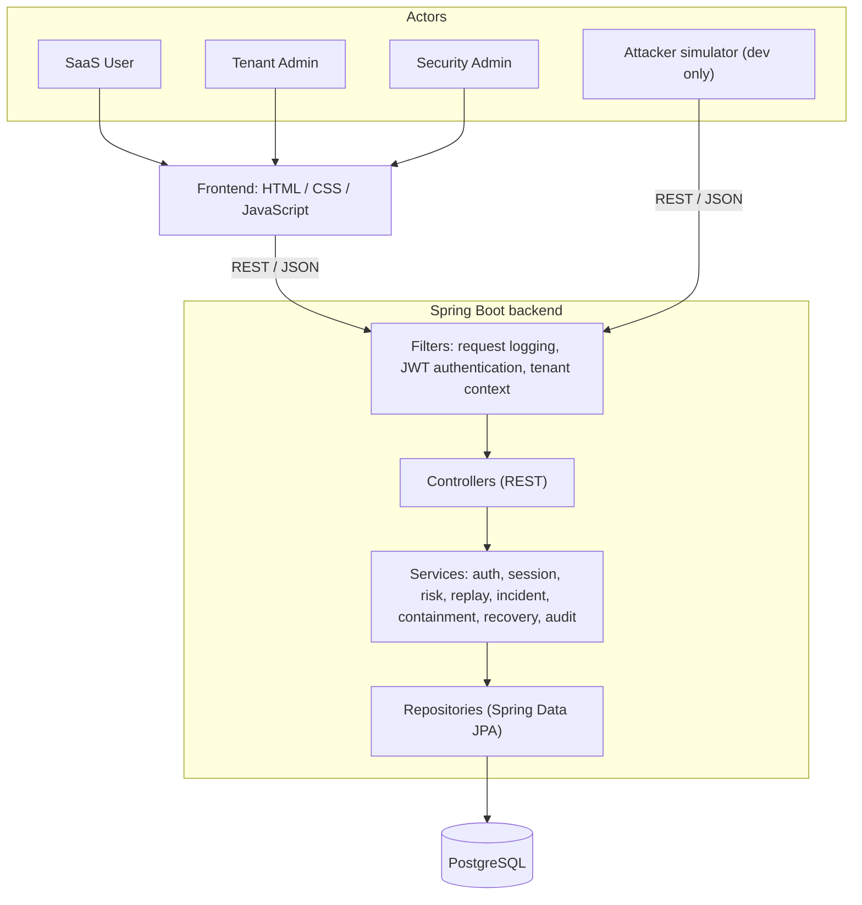
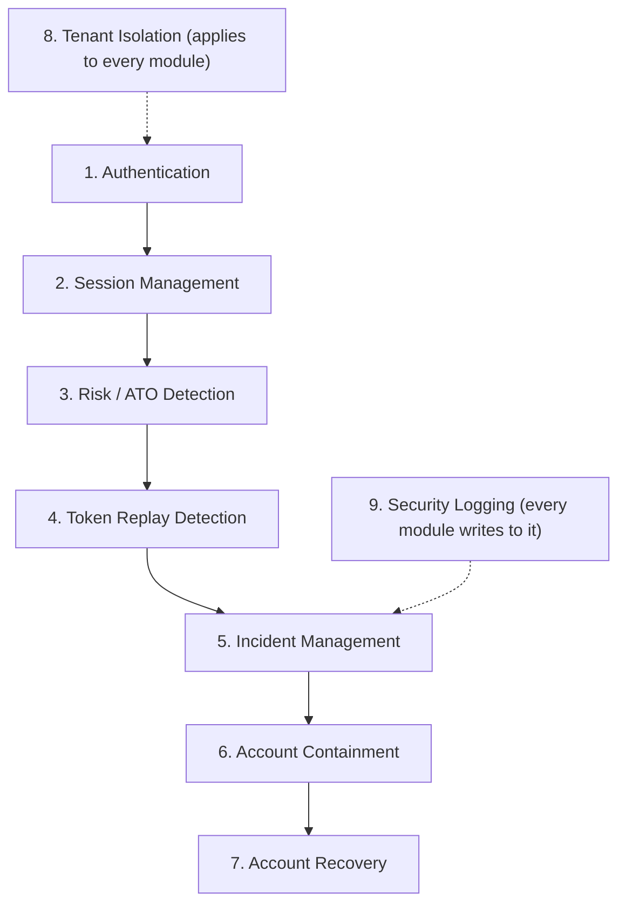

# 02. System Architecture and Modules

## 1. Architecture

**Layers**

| Layer | Responsibility | Rule |
|---|---|---|
| Filter | Log requests, validate JWT, set the current tenant | Never trusts a tenant id from the request body |
| Controller | HTTP in/out, input validation | No business logic |
| Service | Business rules, transactions | Only place that calls repositories |
| Repository | Database access | Every query is scoped by `tenant_id` |
| Model | JPA entities and DTOs | Entities are never returned directly in JSON |

## 2. Module pipeline

## 3. Module list

| # | Module | What it does | Java package | Main tables |
|---|---|---|---|---|
| 1 | Authentication | Register users, log in, BCrypt password hashing, issue JWT access tokens | `security`, `controller` | `users` |
| 2 | Session Management | One session per login, refresh-token rotation, list/revoke sessions | `security`, `service` | `sessions`, `refresh_tokens` |
| 3 | Risk / ATO Detection | Collect signals at login, compute score 0-100, decide allow / step-up / deny | `risk` | `login_events`, `risk_assessments`, `known_devices` |
| 4 | Token Replay Detection | Detect reuse of an already-used refresh token; detect session/device mismatch | `risk` | `refresh_tokens`, `sessions` |
| 5 | Incident Management | Open, update, timeline and close incidents | `incident` | `incidents` |
| 6 | Account Containment | Lock account, revoke sessions, force password reset; reversible | `incident` | `containment_actions`, `users`, `sessions` |
| 7 | Account Recovery | Verify the real owner, set a new password, restore the account | `recovery` | `recovery_requests`, `step_up_challenges` |
| 8 | Tenant Isolation | Make sure tenants cannot see each other's data | `security`, `repository` | `tenant_id` on all tables |
| 9 | Security Logging | Append-only audit trail plus request logging | `logging` | `audit_logs` |

Supporting code: `config` (CORS, later security config), `exception` (JSON error handling), `model` (entities/DTOs).

## 4. Token design

| Token | Format | Lifetime | Stored | Purpose |
|---|---|---|---|---|
| Access token | JWT with claims `sub` (user id), `tenant_id`, `role`, `sid` (session id), `jti` | 15 min | Not stored | Authenticates API calls |
| Refresh token | Random 256-bit string | 7 days, single use (rotated on every refresh) | SHA-256 hash only | Gets a new access token |
| Step-up OTP | 6 digits | 10 min, 3 attempts | Hash only | Extra check for suspicious logins |
| Recovery token | Random 256-bit string or OTP | 15 min, single use | Hash only | Proves ownership during recovery |

**Why containment works:** on every request the backend checks that the session in `sid` is still `ACTIVE`.
Revoking sessions therefore cuts off an attacker at once, even if their 15-minute JWT has not expired.

**Replay detection:** every refresh token is used once. If a token that was already used is presented again,
someone else has a copy. That is a strong theft signal (see `03-ato-workflow.md`).

## 5. Cross-cutting concerns

- **Tenant isolation:** the tenant id is read from the JWT into a `TenantContext`; all repository methods take it
  as a parameter. A resource from another tenant returns `404`, not `403`, so IDs cannot be probed.
- **Two kinds of logs:** *application logs* (console/file, for developers, no secrets) and the *audit log*
  (database table, for security events, append-only).
- **Configuration:** everything environment-specific comes from `application.properties` or environment variables.
  Secrets (DB password, JWT signing key) are never committed.
- **Errors:** all failures use the JSON format of `ErrorResponse`; login errors are deliberately generic.

## 6. Future AWS mapping (not built now)

| Local | AWS |
|---|---|
| Spring Boot jar | ECS Fargate (or Elastic Beanstalk / EC2) |
| PostgreSQL | Amazon RDS for PostgreSQL |
| Static frontend | S3 + CloudFront |
| `notifications` table | Amazon SES |
| Log files | CloudWatch Logs |
| `.env` / properties secrets | AWS Secrets Manager / SSM Parameter Store |
| Manual setup | Terraform in `terraform/` |
