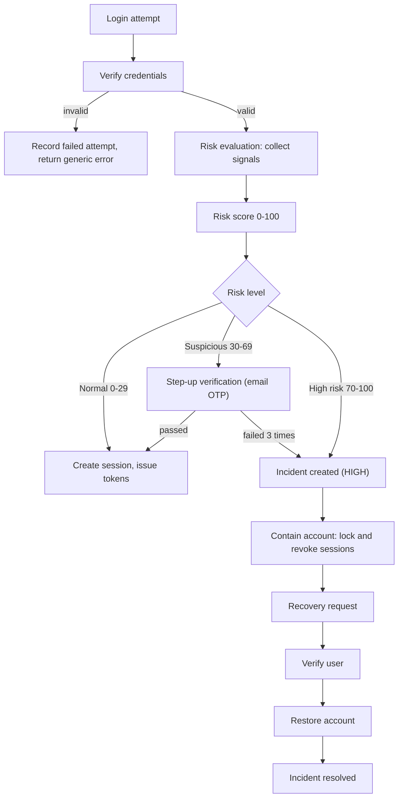
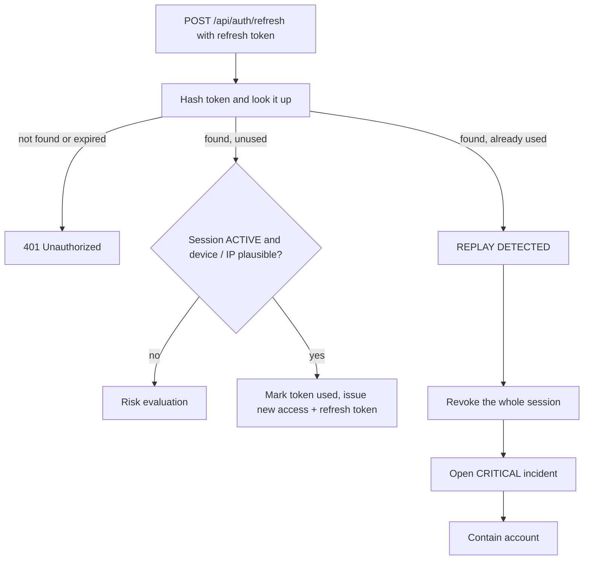
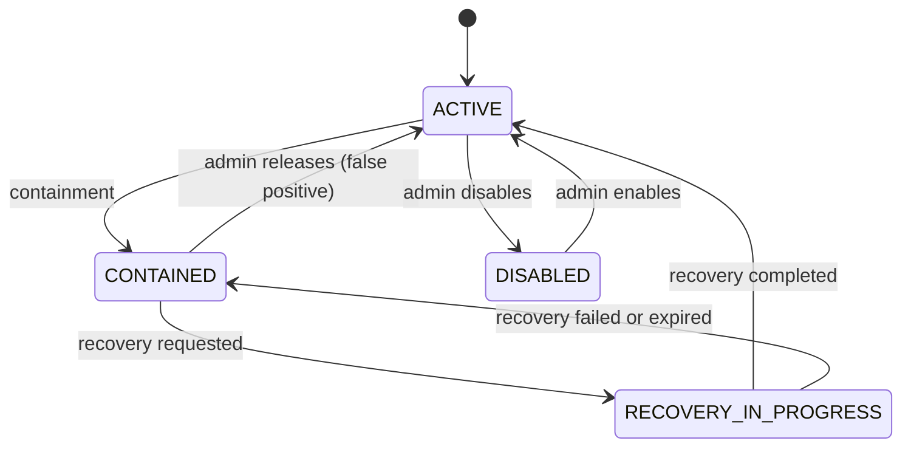
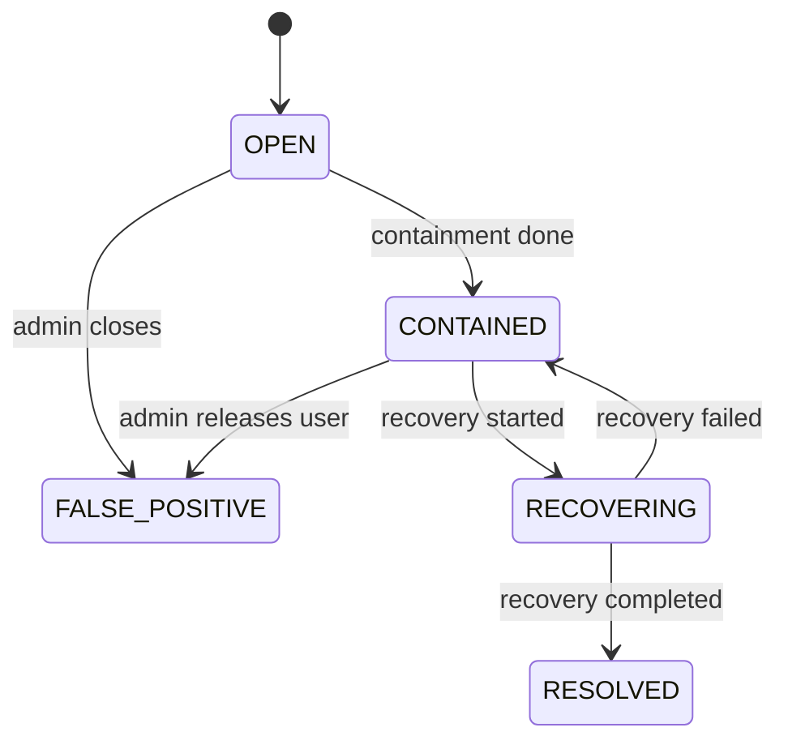

# 03. ATO Workflow

## 1. Lifecycle

An **audit log entry is written at every step**, not only at the end.

### Decision table

| Risk level | Score | Action | Incident | Account status |
|---|---|---|---|---|
| Normal | 0-29 | Allow login | None | ACTIVE |
| Suspicious | 30-69 | Require step-up OTP | None if passed. HIGH incident if failed 3 times | ACTIVE, then CONTAINED if failed |
| High risk | 70-100 | Deny login | HIGH incident, opened immediately | CONTAINED |
| Token replay | n/a | Revoke session family | CRITICAL incident, opened immediately | CONTAINED |

**Design choice:** a suspicious login that passes step-up is only recorded in `risk_assessments` and the audit log.
Opening an incident for every new device would create alert fatigue for a small team. This is easy to change later.
An unanswered step-up (expired) is logged, not escalated.

The thresholds (30 and 70) are defaults and can be tuned per tenant in `tenant_security_settings`.

## 2. Risk signals (initial rule set)

Points are added together and capped at 100. Weights live in configuration so they can be tuned.

| Signal | Points | How it is detected |
|---|---|---|
| New device | +20 | Device hash not in `known_devices` for this user |
| New country | +20 | Country not seen in the user's previous successful `login_events` |
| Impossible travel | +40 | Two logins from different countries closer together than a plausible travel time |
| Failed-login burst before success | +25 | 5 or more failures for the account in the last 10 minutes |
| Known-bad IP | +30 | IP appears on a local blocklist |
| Unusual hour | +10 | Login outside the user's usual hours (only after enough history exists) |
| Refresh token replay | +100 | Used refresh token presented again (always High) |

**Worked examples**

| Situation | Signals | Score | Level |
|---|---|---|---|
| Usual laptop, usual country | none | 0 | Normal |
| New phone, same country | new device | 20 | Normal |
| New laptop in a new country | new device + new country | 40 | Suspicious |
| New laptop, new country, after 6 failed tries | 20 + 20 + 25 | 65 | Suspicious |
| Same as above, from a blocklisted IP | 20 + 20 + 25 + 30 | 95 | High risk |

Every assessment stores the list of triggered signals in `risk_assessments.signals`, so an admin can see **why**
a score was given.

## 3. Token replay flow

Why it works: after the real user refreshes, the old token is marked used. A thief holding that old copy
(or the real user, if the thief refreshed first) will present a used token. Either way, two parties hold the
same token, so the session is killed and the account is contained.

## 4. Containment

Containment must be **fast, complete and reversible**. When triggered (automatically or manually):

1. Set `users.status = CONTAINED`.
2. Revoke all `ACTIVE` sessions and refresh tokens of the user (`revoked_reason = CONTAINMENT`).
3. Reject new logins and refreshes for the user with a generic message that points to recovery.
4. Record each step in `containment_actions` (so it can be reviewed and reverted).
5. Set the incident to `CONTAINED`.
6. Write audit log entries and queue a notification to the user and the tenant admin.

Containment does **not** delete data or change the password. It only stops access.

## 5. Recovery

**Self-service path (email OTP)**

1. User calls `POST /api/recovery/request` with tenant and email. The response is always the same, whether or
   not the account exists.
2. If the account is `CONTAINED`, the system creates a `recovery_request` (15-minute, single-use token) and
   sends it through the `notifications` table (email later). Account status becomes `RECOVERY_IN_PROGRESS`.
3. User submits the code to `POST /api/recovery/verify`. Wrong codes are counted; 3 failures cancel the request.
4. User sets a new password via `POST /api/recovery/complete` (must meet policy and differ from the old one).
5. System sets the user `ACTIVE`, keeps old sessions revoked, marks the request `COMPLETED`, sets the incident
   `RESOLVED`, and notifies the user.

**Admin-assisted path** (for when the user's email is also compromised): a Tenant Admin verifies the person
out-of-band (phone, in person) and approves the request through `POST /api/admin/recovery/{id}/approve`.
The rest of the flow is the same. The approval is audited with the admin's identity.

## 6. State machines

**User account**

**Incident**

**Session**: `ACTIVE` to `REVOKED` (logout, containment, replay) or `EXPIRED`.

**Recovery request**: `PENDING` to `VERIFIED` to `COMPLETED`; or `EXPIRED`, `FAILED`, `CANCELLED`.

## 6b. Audit event names

`LOGIN_SUCCESS`, `LOGIN_FAILED`, `RISK_EVALUATED`, `STEP_UP_REQUIRED`, `STEP_UP_PASSED`, `STEP_UP_FAILED`,
`SESSION_CREATED`, `SESSION_REVOKED`, `TOKEN_REFRESHED`, `TOKEN_REPLAY_DETECTED`, `INCIDENT_CREATED`,
`INCIDENT_STATUS_CHANGED`, `ACCOUNT_CONTAINED`, `ACCOUNT_RELEASED`, `RECOVERY_REQUESTED`, `RECOVERY_VERIFIED`,
`RECOVERY_COMPLETED`, `RECOVERY_FAILED`, `PASSWORD_CHANGED`, `USER_CREATED`, `SETTINGS_CHANGED`,
`CROSS_TENANT_ACCESS_DENIED`.

Audit entries never contain passwords, tokens or OTPs.
