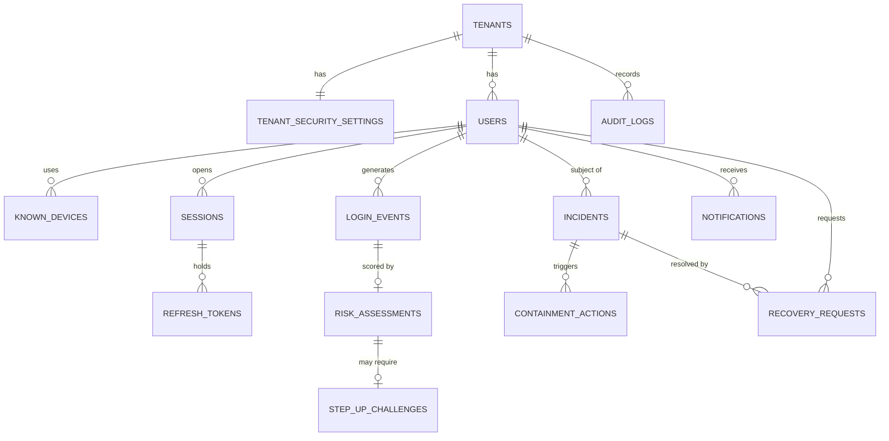

# 04. Basic Database Design

PostgreSQL. The full draft DDL is in [`database/schema_draft.sql`](../database/schema_draft.sql).
It is a **design draft and is not run by the application yet**. In Phase 2 it will become JPA entities and/or
migration scripts (for example Flyway).

## 1. ER diagram

## 2. Tables

| Table | Purpose | Key columns |
|---|---|---|
| `tenants` | One row per customer SaaS company (plus a `platform` tenant for security admins) | `id`, `name`, `slug`, `status` |
| `tenant_security_settings` | Per-tenant thresholds and limits | `suspicious_threshold`, `high_risk_threshold`, `max_failed_logins`, `recovery_token_ttl_minutes` |
| `users` | Accounts | `tenant_id`, `email`, `password_hash`, `role`, `status`, `failed_login_count` |
| `known_devices` | Devices previously seen for a user (hashed) | `user_id`, `device_hash`, `first_seen_at`, `trusted` |
| `sessions` | One per successful login | `user_id`, `device_hash`, `ip_address`, `country`, `status`, `expires_at`, `revoked_reason` |
| `refresh_tokens` | Rotating refresh tokens (hash only) | `session_id`, `token_hash`, `parent_token_id`, `used_at`, `expires_at` |
| `login_events` | Every login attempt, successful or not; the history for risk rules | `email_attempted`, `success`, `ip_address`, `country`, `device_hash`, `failure_reason` |
| `risk_assessments` | Result of scoring, with explanation | `score`, `risk_level`, `signals` (JSONB), `decision` |
| `step_up_challenges` | Pending OTP checks for suspicious logins | `risk_assessment_id`, `otp_hash`, `attempts`, `status`, `expires_at` |
| `incidents` | Security incidents | `user_id`, `incident_type`, `severity`, `status`, `risk_score`, timestamps |
| `containment_actions` | What was done to contain, and whether it was reverted | `incident_id`, `action_type`, `performed_by_type`, `reverted_at` |
| `recovery_requests` | Account recovery attempts | `user_id`, `incident_id`, `method`, `token_hash`, `status`, `failed_attempts`, `expires_at` |
| `audit_logs` | Append-only security trail | `tenant_id`, `actor_type`, `action`, `target_id`, `incident_id`, `details` (JSONB) |
| `notifications` | Simulated outgoing email (dev outbox) | `user_id`, `purpose`, `subject`, `body` |

## 3. Design rules

1. **Tenant isolation:** every table except `tenants` has `tenant_id`. Tables that point to a user use a
   composite foreign key `(tenant_id, user_id) -> users (tenant_id, id)`, so the database itself refuses a row
   that mixes tenants.
2. **UUID primary keys** (except `audit_logs`, which uses a sequence) so ids cannot be guessed or counted.
3. **No secrets stored:** passwords use BCrypt; refresh tokens, OTPs and recovery tokens are stored as hashes.
4. **Enums are `VARCHAR` with `CHECK` constraints**, which is easier to use from JPA than native PostgreSQL enums.
5. **Timestamps** are `TIMESTAMPTZ` (UTC).
6. **Emails** are stored lower-case and are unique per tenant, not globally.
7. **Audit log is append-only:** the application role should get `INSERT` and `SELECT` only on `audit_logs`
   (enforced when roles are set up in a later phase).
8. **Indexes** cover the common lookups: user + time for `login_events`, tenant + status for `incidents`,
   user + status for `sessions`, tenant + time for `audit_logs`.
